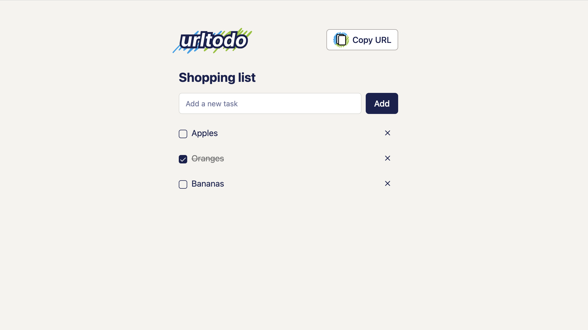

<p align="center">
	
</p>

<p align="center">
  A simple todo list that can be shared with others.
</p>

<p align="center">
  <a href="https://www.urltodo.com">urltodo.com</a>
</p>

<p align="center">
  The link is the list.
</p>

## Try it out 
[https://www.urltodo.com](https://www.urltodo.com)




## Implementation
urltodo is a Next.js SPA app built with ShadCN. 

## Running locally (not obvious) 
The local development server (`npm run dev`) runs useEffects twice and I believe this basically breaks the app locally.

Instead you must build the app and serve the `/out` directory over `http-server`. You can do this with the `serve-build` command. 

`npm run dev` is still quite useful for styling and non URL encoding/decoding dependent tasks because it runs faster and has HMR.

```bash
npm run serve-build
# output at http://127.0.0.1:8080

npm run dev
# output at http://127.0.0.1:3000
```

## Testing 
The tests are written in Playwright.
```bash
npm run test
```

## Setting up git hooks 
The pre-commit test hook is in the `./githooks/pre-commit` file.

### Add the pre-commit hook
```bash
cp ./githooks/pre-commit ./.git/hooks/pre-commit

# Make it executable
chmod +x .git/hooks/pre-commit
```